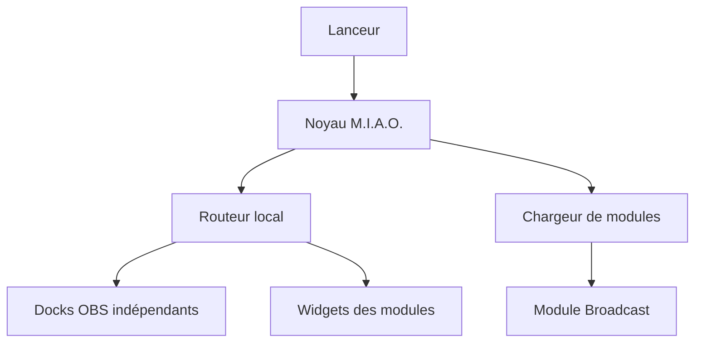

# Architecture de M.I.A.O.

## Intention

M.I.A.O. 4 sépare l’infrastructure commune des fonctionnalités de stream. Le noyau démarre le serveur, charge les modules et distribue les requêtes ; il ne connaît ni Moobot, ni une mission, ni Tunic. Chaque fonctionnalité peut ainsi évoluer ou être testée sans modifier les autres.

## Responsabilités

| Couche | Emplacement | Responsabilité |
| --- | --- | --- |
| Point d’entrée | `scripts/start-miao.ps1` | paramètres, options destinées aux modules, lancement |
| Application | `src/Miao.App.psm1` | contexte, écoute locale et cycle de vie |
| Modules | `src/Miao.Modules.psm1` | découverte, validation, chargement, mise à jour et arrêt |
| Routage | `src/Miao.Routes.psm1` | routes centrales, ressources modulaires et délégation API |
| HTTP | `src/Miao.Http.psm1` | requêtes, JSON, texte et fichiers binaires |
| Sécurité web | `src/Miao.Web.psm1` | méthodes autorisées, erreurs API et contrôle d’origine |
| Persistance | `src/Miao.Files.psm1` | lecture UTF-8 et écritures atomiques |
| Réglages | `src/Miao.Settings.psm1` | validation générique par schéma et migration |
| Fonctionnalités | `modules/<id>/` | état, API, widget, dock et configuration d’un domaine |
| Données locales | `var/<id>/` | état utilisateur persistant d’un module, ignoré par Git |

## Démarrage

1. Le lanceur transmet au noyau les options propres aux modules.
2. Le chargeur lit tous les `modules/*/module.json` dans l’ordre de leur identifiant.
3. Tous les manifestes actifs sont validés avant l’initialisation du premier module.
4. Chaque point d’entrée PowerShell est importé et son hook `initialize` produit un état privé.
5. Le serveur commence à écouter sur `127.0.0.1`.
6. La boucle appelle les hooks `update` selon l’intervalle déclaré et délègue les routes API.
7. À l’arrêt, les hooks `shutdown` sont appelés même si un autre module échoue.

Une erreur d’initialisation empêche un démarrage partiel. Les modules déjà initialisés sont arrêtés avant que l’erreur soit remontée.

## Routage

Le noyau possède uniquement les routes communes :

| Route | Propriétaire |
| --- | --- |
| `/control`, `/miao-control.html` | dock historique du module déclaré par défaut |
| `/control/<id>` | dock indépendant d'un module actif |
| `/assets/api.js`, `/assets/control.js`, `/assets/control.css` | ressources communes |
| `/api/modules` | description publique des interfaces modulaires |
| `/health` | état de l’application et liste des modules actifs |
| `/modules/<id>/...` | fichier public confiné au module concerné |

Les routes `/`, `/miao-widget.html` et les anciennes ressources `/assets/widget*` sont des alias déclarés par Broadcast. Ses API historiques restent inchangées, mais leur implémentation se trouve désormais dans `modules/broadcast/server/Miao.Broadcast.psm1`.

Le serveur sait envoyer des fichiers texte ou binaires. Un futur module peut donc servir ses images PNG sans encodage Base64 ni ajout de route au noyau.

## Docks indépendants

`public/control.html` est une coquille réutilisée par chaque dock. Au chargement, elle demande `/api/modules`, sélectionne le module indiqué dans l'URL, puis charge uniquement ses styles, fragments et scripts. Une panne de chargement dans un dock n'empêche pas l'ouverture d'un autre. L'onglet mémorisé est propre à chaque module.

Un seul manifeste peut déclarer `control.legacyDefault: true` pour les URL historiques `/control` et `/miao-control.html`. Broadcast porte cette déclaration. Les nouveaux modules utilisent directement `/control/<id>`. Les préfixes `/control/`, `/modules/` et `/api/` sont réservés et ne peuvent pas être revendiqués comme alias de widget.

L'indépendance concerne les pages OBS et l'état fonctionnel, pas des processus séparés : les hooks serveur restent exécutés dans un processus commun. La validation et l'initialisation du serveur demeurent globales ; un manifeste actif invalide empêche le démarrage. Les hooks doivent rester courts et ne pas effectuer d'attente réseau synchrone.

Les identifiants HTML internes doivent eux aussi être préfixés (`broadcast-…`, `tunic-…`) pour éviter toute collision dans le document assemblé. Les URL fournies au navigateur sont validées une première fois au démarrage par PowerShell et une seconde fois dans le dock.

## Module Broadcast

Broadcast regroupe tout l’ancien domaine fonctionnel de M.I.A.O. 3 :

- détection de la source Moobot ;
- nettoyage en mémoire du titre ;
- transmission libre ;
- schéma des 42 réglages ;
- widget animé ;
- huit commandes du Song Player.

Ses fichiers runtime sont isolés dans son dossier de données :

- `var/broadcast/settings.json` ;
- `var/broadcast/mission.txt`.

Au premier démarrage, Broadcast copie les anciens fichiers `miao-settings.json` et `miao-mission.txt` présents à la racine lorsque les nouvelles destinations n’existent pas. Cette migration ne supprime et n’écrase aucune donnée historique.

L’absence temporaire de Moobot ne bloque plus l’application. Broadcast conserve une radio vide et retente périodiquement la détection automatique.

## Sécurité et robustesse

- écoute limitée à l’interface de boucle locale ;
- refus des mutations provenant d’une autre origine web ;
- liste blanche pour les raccourcis Moobot ;
- validation des manifestes avant exécution ;
- refus des traversées de dossiers et des alias réservés ;
- types MIME explicites et en-tête `nosniff` ;
- écritures utilisateur atomiques et sauvegardes avant migration ;
- erreurs de mise à jour isolées par module afin de préserver la boucle principale.

Le détail du format de manifeste et des hooks se trouve dans [MODULES.md](MODULES.md).

## Transport et persistance

Les lectures et écritures TCP sont asynchrones et suivies par connexion. La boucle accepte au plus huit nouveaux clients par tour, avec 64 connexions actives maximum. Une lecture ou une écriture expire après trois secondes au total, même si quelques octets continuent d'arriver. Les en-têtes sont limités à 16 Kio et les corps à 256 Kio. Les requêtes utilisent Content-Length ; le transfert chunked et le pipelining ne sont pas pris en charge. Chaque réponse ferme sa connexion après la fin de l'écriture. Les handlers et lectures de fichiers restent synchrones : ce changement supprime l'attente réseau dans la boucle, sans transformer les modules en tâches parallèles.

Les sauvegardes utilisent un fichier temporaire voisin puis File.Replace pour une destination existante, ou File.Move pour une nouvelle destination. Le paramètre de sauvegarde nul est transmis avec NullString pour PowerShell 5.1. Si le remplacement échoue, l'erreur est remontée et le temporaire supprimé ; aucune copie avec écrasement n'est tentée. L'ancien fichier est conservé.
