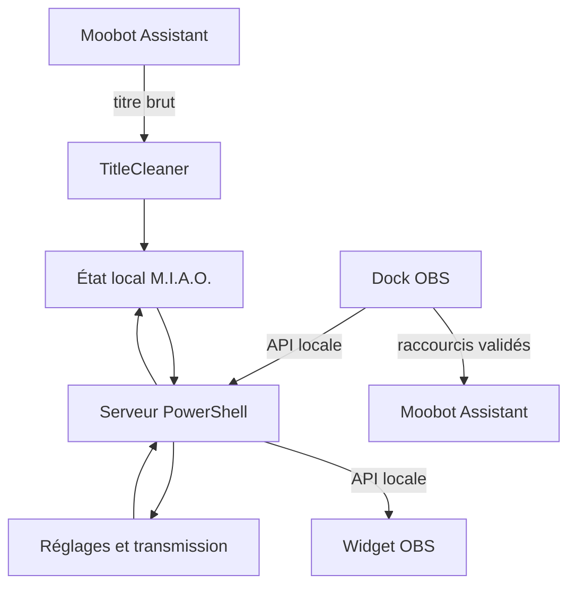

# Architecture de M.I.A.O.

## Objectifs

L’architecture privilégie la maintenabilité sans ajouter de runtime ou d’installation technique au poste de stream.

- Le fichier `miao-clean-title.ps1` est un point d’entrée stable et minimal.
- Les responsabilités PowerShell sont séparées par module.
- Le HTML, le CSS et le JavaScript ne sont plus mélangés.
- Les réglages n’ont qu’une source de vérité : `config/settings.schema.json`.
- Les données propres à l’utilisateur ne sont pas distribuées dans l’archive.

## Flux principal

## Modules PowerShell

| Module | Responsabilité |
| --- | --- |
| `Miao.App.psm1` | Initialisation, contexte et cycle de vie applicatif |
| `Miao.Routes.psm1` | Routage, API locale et contrôle de l’origine des mutations |
| `Miao.Http.psm1` | Lecture des requêtes et réponses HTTP |
| `Miao.Files.psm1` | Lecture UTF-8 et écritures atomiques |
| `Miao.Settings.psm1` | Schéma, migration, validation et persistance |
| `Miao.Mission.psm1` | Initialisation, normalisation et sauvegarde de la transmission |
| `Miao.Moobot.psm1` | Détection générique de la source Song Player |
| `Miao.TitleCleaner.psm1` | Nettoyage en mémoire et surveillance du titre Moobot |
| `Miao.Hotkeys.psm1` | Liste blanche et émission des raccourcis Song Player |

## Configuration pilotée par schéma

Chaque champ de `config/settings.schema.json` contient :

- sa clé stable ;
- son type ;
- sa valeur par défaut ;
- ses limites éventuelles ;
- son groupe et son libellé pour le dock.

Le serveur utilise ce schéma pour valider et migrer les données. Le dock l’utilise pour construire automatiquement ses champs. Ajouter un réglage ne doit donc jamais nécessiter de recopier sa valeur par défaut dans le JavaScript. Les contraintes entre champs, comme le seuil « très compact » qui ne peut pas précéder le seuil « compact », sont elles aussi déclarées dans le schéma.

## API locale

| Méthode | Route | Usage |
| --- | --- | --- |
| `GET` | `/api/state` | État complet destiné au widget et au chargement du dock |
| `GET` | `/api/song` | Titre courant léger pour le dock |
| `GET` | `/api/schema` | Schéma des réglages |
| `GET` | `/api/player/actions` | Actions Moobot autorisées |
| `POST` | `/api/mission` | Sauvegarde de la transmission |
| `POST` | `/api/settings` | Validation et sauvegarde des réglages |
| `POST` | `/api/settings/reset` | Restauration des valeurs par défaut |
| `POST` | `/api/player` | Déclenchement d’une action Moobot en liste blanche |

Les corps `POST` sont encodés en Base64 UTF-8. Ce choix évite toute ambiguïté entre longueur en caractères et longueur en octets dans le petit serveur HTTP compatible Windows PowerShell 5.1.

Le serveur refuse aussi toute mutation portant une origine web différente de ses adresses locales. Les requêtes sans en-tête `Origin`, par exemple un diagnostic local en ligne de commande, restent autorisées.

Le serveur traite volontairement les quelques requêtes locales l’une après l’autre. Cela garde le runtime autonome et prédictible ; le widget et le dock n’émettent que des requêtes très courtes.

## Persistance

Les fichiers suivants sont créés à l’exécution, à côté du lanceur :

- `miao-settings.json` ;
- `miao-mission.txt`.

Ils sont écrits par remplacement atomique afin de limiter le risque de corruption lors d’une fermeture brutale. Une migration de schéma et un fichier de réglages illisible déclenchent d’abord une copie de secours. Ces données et leurs sauvegardes ne doivent pas être ajoutées aux paquets de mise à jour.

Le fichier brut du Song Player reste la propriété de Moobot Assistant. M.I.A.O. détecte automatiquement `*.song-player.current.txt` dans `%APPDATA%`, puis conserve le titre nettoyé dans son état en mémoire. Si plusieurs sources existent, la plus récemment modifiée est utilisée ; `-Channel` et `-SourcePath` permettent toujours une sélection explicite. Aucun fichier `*.cleaned.txt` n’est nécessaire ou créé.

## Règles d’évolution

1. Conserver les routes historiques `/`, `/control`, `/miao-widget.html` et `/miao-control.html`.
2. Ajouter tout réglage utilisateur dans le schéma avant de l’utiliser dans le widget.
3. Ne jamais accepter un nom de touche ou une commande arbitraire depuis le navigateur.
4. Garder le PowerShell en caractères ASCII pour Windows PowerShell 5.1 sans BOM.
5. Exécuter les tests de contrat avant de créer l’archive.
6. Mettre à jour `VERSION` et `CHANGELOG.md` pour toute nouvelle version distribuée.
